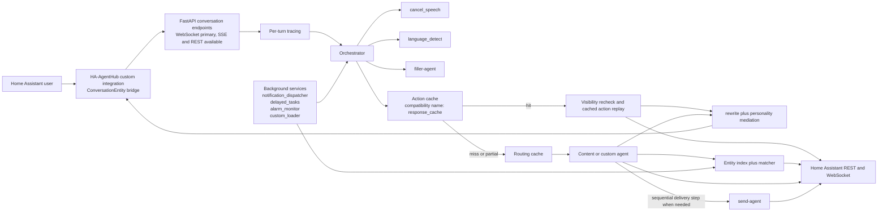

# HA-AgentHub Project Definition

HA-AgentHub is a multi-agent Home Assistant assistant built around a container execution engine and a thin Home Assistant bridge.

This document describes the repository as it exists today. Planned or partial work is tracked in [TODO.md](TODO.md) instead of being described as current behavior.

> Naming note: the public product name is `HA-AgentHub`. Some internal and runtime identifiers still use legacy `agent-assist` naming for backward compatibility, including local compose service names, database and cookie prefixes, and cache export tags.

---

## Project Overview

**Project Name:** HA-AgentHub

**Description:** HA-AgentHub accepts text from Home Assistant, routes the turn through an internal A2A-based orchestration layer, resolves entities against a persistent entity index, executes Home Assistant actions from the container, and streams speech back through the Home Assistant custom integration. The container is the execution engine. The Home Assistant integration is the I/O bridge.

### Goals

- Fast, accurate natural-language control of Home Assistant entities and services
- Clear separation between the container runtime and the Home Assistant bridge
- Internal A2A protocol boundaries so agents can communicate through consistent message envelopes
- Reuse repeated work through a routing cache and a user-facing action cache
- Resolve entities with deterministic checks first and hybrid matching only when needed
- Support multiple LLM providers through a single adapter layer
- Extend behavior through MCP servers, custom agents, and plugins
- Provide an admin surface for setup, operations, tracing, cache management, and settings
- Stay compatible with Home Assistant installation flows through a HACS-ready custom integration

### Design Philosophy

- Container-first: AI, orchestration, cache, entity resolution, and Home Assistant execution all live in the container
- Thin bridge: the Home Assistant integration forwards requests, enriches origin context, and streams responses back
- Async-native: HTTP, WebSocket, agent dispatch, entity sync, and dashboard/API work all run on asyncio
- Cache-aware: repeated requests should skip classification or full agent execution when a safe cache path exists
- Verbatim-first: original user wording is preserved for entity and area resolution, especially across translated turns
- Modular: agents, MCP servers, plugins, and custom agents can be enabled or disabled independently
- Current-state docs only: roadmap items are labeled explicitly rather than blended into the main design
- Operational clarity: tracing, analytics, system health, and setup state are part of the runtime, not afterthoughts
- Trust boundaries are explicit: plugins and external tool servers are extensibility points, not isolated runtimes

---

## Architecture

HA-AgentHub currently has two primary components:

1. **Docker container**: the FastAPI runtime that owns orchestration, caches, entity indexing and matching, LLM access, MCP integration, plugins, dashboard and API routes, and direct Home Assistant action execution.
2. **Home Assistant custom integration**: a `ConversationEntity` bridge that maintains the preferred WebSocket link to the container, falls back to REST when needed, forwards origin context, and streams response text or filler speech back to Home Assistant.

This two-component split is still accurate. The container performs the work. The integration does not classify, resolve entities, or call Home Assistant services on behalf of agents.

### Architecture Diagram



Current runtime notes:

- Action-cache hits short-circuit live agent execution only when a replayable cached action exists.
- The orchestrator can run a content agent and `send-agent` sequentially in the same turn.
- Filler speech, rewrite, mediation, and tracing are runtime stages, not future design ideas.
- Entity index priming, state-change updates, delayed notifications, timers, alarms, and custom-agent loading run as background services around the main request path.

---

## Technology Stack

### Container Runtime Stack

| Component | Current Technology | Notes |
| --- | --- | --- |
| Web framework | FastAPI | Main HTTP, WebSocket, setup, API, and dashboard runtime |
| ASGI server | Uvicorn | Container application server |
| LLM integration | litellm | Provider abstraction for local and hosted LLMs |
| Local embeddings | `intfloat/multilingual-e5-small` | Seeded default local embedding model |
| Vector storage | ChromaDB | Entity index plus routing and action cache persistence |
| Structured data | SQLite + aiosqlite | Settings, secrets, traces, analytics, users, history, custom agents |
| Agent protocol | A2A over JSON-RPC 2.0 envelopes | Current transport is in-process |
| Entity matching | rapidfuzz, pyphonetics, embedding search, optional LLM expansion | Deterministic resolution runs before hybrid fallback |
| Home Assistant access | aiohttp/httpx-based clients | REST execution plus HA WebSocket subscriptions |
| Admin surface | Server-rendered dashboard templates and admin APIs | Setup, operations, traces, cache, settings, MCP, plugins, send devices |
| Extensibility | MCP client plus in-process Python plugins | MCP supports `stdio` and `sse` transports |

### Home Assistant Bridge Stack

| Component | Current Technology | Notes |
| --- | --- | --- |
| Integration runtime | Home Assistant Python integration | Registers a conversation entity |
| Network client | aiohttp | Persistent WebSocket plus REST fallback |
| Authentication | Container API key | Stored in the config entry and revalidated in options flow |
| Response delivery | Home Assistant conversation response plus filler TTS | Streams text and can play interim filler speech |

### Async Stack

The runtime is async end to end. Conversation streaming, agent dispatch, Home Assistant REST and WebSocket calls, entity-index refresh, dashboard APIs, cache operations, and reconnect loops all rely on Python asyncio. Long-running or blocking cache and vector-store operations are pushed off the event loop where needed.

---

## Component Descriptions

### Container Runtime

#### API and Admin Surface

- Conversation entrypoints expose WebSocket, SSE, and REST conversation routes.
- Admin APIs cover setup, cache inspection and flushing, traces, analytics, entity index operations, MCP management, plugins, send-device mappings, and settings.
- The dashboard currently routes to overview, login, agent configuration, system health, chat testing, personality, cache, entity index, analytics, traces, MCP servers, custom agents, timers, plugins, send devices, and unified settings pages.

#### Orchestrator

The orchestrator is the single request coordinator inside the container. For each turn it can:

- annotate per-turn trace metadata
- short-circuit cancel or dismiss requests
- detect or honor reply language
- emit filler speech when the first useful token is slow
- check the action cache first and the routing cache second
- dispatch to built-in or custom agents through the A2A layer
- run sequential content-agent then `send-agent` delivery when a turn mixes content generation and notification delivery
- merge or mediate final speech before streaming the response back
- store eligible routing and action-cache entries after successful execution

#### Specialized Agents

Built-in domain agents are responsible for their own execution. For actionable turns that means resolving the target entity, calling the relevant Home Assistant service from the container, and returning verified action results rather than tool-call placeholders. `send-agent` is the delivery-oriented exception: it routes content to notify targets or assist satellites instead of directly mutating an entity state.

#### Entity Index and Matching

The container primes a persistent entity index from Home Assistant and keeps it fresh through WebSocket `state_changed` events plus a periodic background sync. Agents and executors use deterministic entity lookup first, then hybrid matching when needed. Visibility rules are applied as part of the resolution path.

#### Cache Layer

The cache manager exposes a routing cache and a public action cache. Internal collection names and compatibility APIs still retain `response` naming. Action-cache hits replay stored Home Assistant actions only after rechecking entity visibility. Failed replays are invalidated and retried through the live orchestration path. Cache export and import are supported.

#### Dashboard and Operations

The current admin surface is operational, not aspirational. It includes setup and login flows, cache tooling, analytics, traces, entity-index management, timers and alarms, MCP server management, custom-agent controls, plugin management, send-device mappings, and unified advanced settings.

Visual conventions for the admin surface are documented in `docs/style-guide.md`.

#### Plugin System

Plugins are Python code loaded in-process. Lifecycle hooks currently include `configure`, `startup`, `ready`, and `shutdown`. Plugins can extend routing, register agents, add routes, or integrate with other runtime services, but they are not isolated from the main process. They should be treated as trusted code installed by an administrator.

### Home Assistant Bridge

The Home Assistant integration remains a thin bridge, but it does more than a blind forwarder:

- validates and stores the container URL and API key through config flow and options flow
- keeps a persistent WebSocket connection with reconnect backoff
- falls back to REST when a request has not yet been written to the socket
- avoids duplicate container work by coalescing near-identical in-flight turns
- enriches forwarded turns with `device_id`, `device_name`, `area_id`, and `area_name` when available
- plays filler speech through Home Assistant TTS when the container emits filler tokens
- trusts backend markdown sanitization when advertised and falls back to local stripping otherwise
- migrates legacy config-entry titles from `Agent Assist` to `HA-AgentHub`

The integration does not resolve entities, classify intent, or execute Home Assistant services on behalf of agents.

---

## Agent System Design

### Current Routable Agents

| Agent | Current Role | Notes |
| --- | --- | --- |
| `orchestrator` | Request entrypoint and coordinator | Always active as the control plane |
| `general-agent` | General answers and fallback handling | Can use assigned MCP tools |
| `light-agent` | Lighting actions and state queries | Registered by default |
| `music-agent` | Music and media-oriented commands | Registered by default |
| `timer-agent` | Timer workflows | Registered when enabled |
| `climate-agent` | Climate and thermostat actions | Registered when enabled |
| `media-agent` | Media-player actions | Registered when enabled |
| `scene-agent` | Scene activation and related actions | Registered when enabled |
| `automation-agent` | Automation enable, disable, and trigger flows | Registered when enabled |
| `security-agent` | Locks, alarms, cameras, and related security queries | Registered when enabled |
| `send-agent` | Delivery to notify targets and satellites | Registered when enabled |
| `lists-agent` | Todo and shopping list management | Registered when enabled |
| custom agents | Database-backed runtime agents | Loaded through the custom-agent loader |

### Helper and Internal Stages

| Stage | Current Responsibility |
| --- | --- |
| `cancel_speech` | Detect dismiss or cancel turns before live dispatch |
| `language_detect` | Resolve per-turn reply language when auto mode is active |
| `filler-agent` | Emit interim speech for slow turns |
| `rewrite-agent` | Rephrase cache-hit speech when rewrite is enabled |
| personality mediation | Optional final response mediation layer driven by runtime settings |
| `sanitize` | Markdown stripping and speech-safe output cleanup |
| `notification_dispatcher` | Background notification delivery support |
| `delayed_tasks` | Deferred task scheduling support |
| `alarm_monitor` | Background alarm and timer monitoring |
| `custom_loader` | Runtime loading of persisted custom agents |

### Entity Visibility Controls

Entity visibility is managed through database-backed per-agent rules. The runtime can include or exclude by domain, area, entity, or device-class-oriented criteria, and the same rules are used during deterministic lookup, hybrid matching, and cached-action visibility rechecks. The dashboard now treats entity visibility as part of the entity-index management surface rather than a separate dedicated page.

### Hybrid Entity Matching

Entity resolution is a multi-stage pipeline rather than a single weighted guess:

1. exact `entity_id` resolution when the input already contains a valid entity ID
2. exact friendly-name resolution from the indexed entity set
3. exact friendly-name resolution after stripping trailing device nouns from phrases like "keller light"
4. visibility filtering, per-action domain filtering, and originating-area tie-breaks before final selection
5. hybrid scoring across alias, embedding, Levenshtein, Jaro-Winkler, and phonetic signals
6. containment, area, and token-overlap bonuses applied during hybrid scoring
7. preserved `verbatim_terms` tried before translated or condensed text
8. optional on-demand expansion fallback for cold queries, with structured miss logging when resolution still fails

Current seeded defaults that materially affect matching:

| Setting | Current Default |
| --- | --- |
| `embedding.local_model` | `intfloat/multilingual-e5-small` |
| `entity_matching.confidence_threshold` | `0.60` |
| `entity_matching.top_n_candidates` | `3` |
| `entity_matching.oversample_factor` | `20` |
| `entity_matching.expansion.enabled` | `true` |
| `entity_matching.log_misses` | `true` |

### Prompt Design Philosophy

- domain prompts stay narrow and action-oriented
- the orchestrator preserves original names and location terms when condensing tasks
- rewrite, filler, and personality mediation are separate concerns with separate settings
- actionable agents are expected to return executed outcomes, not speculative tool plans

---

## Two-Tier Caching

### Strategy

HA-AgentHub currently uses two persistent vector-backed cache tiers:

1. **Routing cache**: stores query-to-agent routing decisions and condensed tasks.
2. **Action cache**: the public name for the user-facing replay tier that stores speech plus replayable cached actions.

Compatibility note:

- internal collection names still use `response_cache` for backward compatibility on the Chroma side
- runtime settings keys are canonical `cache.action.*` and `cache.routing.*` after migration 23
- there is no partial-threshold tier; partial matches do not short-circuit live execution

### Thresholds and Bounds

| Cache Setting | Current Default |
| --- | --- |
| `cache.routing.semantic_threshold` | `0.92` |
| `cache.routing.max_entries` | `50000` |
| `cache.action.semantic_threshold` | `0.95` |
| `cache.action.max_entries` | `50000` |
| `cache.lru.trigger_fraction` | `0.95` |
| `cache.lru.eviction_interval` | `100` |

Both tiers are persistent and have no TTL, but they are not unbounded. They use LRU-style entry caps to limit growth.

### Current Cache Flow

1. the action cache is checked first because a replayable hit is more valuable than a routing-only hit
2. a full action-cache hit is used only when the entry contains a safe cached action
3. the runtime rechecks entity visibility before replaying the cached action
4. if replay fails, the entry is invalidated and the turn falls through to live orchestration
5. if there is no full action-cache hit, the routing cache can still skip reclassification
6. partial action-cache matches provide context but do not short-circuit live execution
7. rewrite applies only to cache-hit speech; filler and personality mediation remain separate runtime stages
8. export and import operations are available for both tiers

---

## Communication Protocol

### Internal Agent Communication

The internal agent boundary uses A2A message envelopes shaped around JSON-RPC 2.0 semantics. Current message methods include synchronous send, streaming send, agent discovery, and agent listing. The transport is in-process today, so the protocol boundary is logical rather than distributed, but the orchestrator and agent registry already communicate through that abstraction.

### HA Integration and Container

The Home Assistant bridge prefers a persistent WebSocket connection to the container. The container also exposes SSE and REST conversation routes. Current behavior matters more than transport labels:

- WebSocket is the primary path for Home Assistant conversation turns
- SSE remains available as a streaming HTTP surface
- REST is used as the fallback path when the request has not already been written to the WebSocket
- if the socket drops after the request is sent, the integration avoids REST replay to prevent duplicate container work
- streamed filler tokens are marked so the integration can speak them immediately

### Container and Home Assistant

The container and its agents call Home Assistant directly:

- REST requests fetch state and execute services
- the Home Assistant WebSocket is used for live state-change subscriptions and timer-related events
- domain agents and delivery flows execute from the container rather than delegating back to the Home Assistant integration

### Authentication

- Home Assistant integration to container: bearer-style container API key
- Container to Home Assistant: long-lived access token
- Runtime secrets: stored Fernet-encrypted in SQLite
- Dashboard auth: session cookie plus CSRF protection, with `COOKIE_SECURE` controlling HTTPS-only cookie behavior

### Network Topology

The current deployment target is a standalone Docker container connecting back to Home Assistant over the network. The repository does not currently describe Supervisor add-on deployment as shipped behavior.

---

## Data Flow

1. Home Assistant provides a text turn to the HA-AgentHub conversation entity.
2. The integration enriches the request with conversation and origin context and forwards it to the container over WebSocket when possible.
3. The container creates a per-turn trace context and hands the turn to the orchestrator.
4. The orchestrator can short-circuit cancel or dismiss requests and can resolve reply language before live routing.
5. The action cache is checked first. Safe hits replay the cached action after a visibility recheck and then reuse or rewrite the cached speech.
6. If the turn is not satisfied by the action cache, the routing cache may reuse a prior routing decision.
7. Live dispatch sends the task to a content agent, custom agent, or fallback agent. Entity resolution uses deterministic lookup first, then hybrid matching, with visibility, area, and domain filters applied before final selection.
8. If the turn also requires delivery, the orchestrator runs the content-producing step first and `send-agent` second.
9. The container mediates final speech as configured, streams filler and final tokens back to Home Assistant, and records analytics and traces.
10. Successful live turns can update the routing cache and, when replay is safe, the action cache.

---

## Project Structure

```text
.github/
  instructions/
    project-definition.md

container/
  Dockerfile
  docker-compose.yml               # Published-image / deployment compose file
  docker-compose_local.yml         # Local-build compose file with legacy runtime naming
  requirements.txt
  requirements-dev.txt
  app/
    main.py
    config.py
    runtime_setup.py
    a2a/
    agents/
    analytics/
    api/
    cache/
    dashboard/
    db/
    entity/
    ha_client/
    llm/
    mcp/
    middleware/
    models/
    plugins/
    prompts/
    security/
    setup/
    util/
  tests/
    data/                          # Test fixtures and supporting data
    scenarios/                     # Scenario framework inputs and scenario cases
    conftest.py
    helpers.py
    test_agents.py
    test_real_scenarios.py

custom_components/
  ha_agenthub/
    __init__.py
    config_flow.py
    const.py
    conversation.py
    manifest.json
    strings.json
    brand/
    translations/

docs/
  api-reference.md
  architecture.md
  backup-restore.md
  configuration.md
  deployment.md
  plugin-development.md
  TODO.md
  troubleshooting.md
  SubAgent/

README.md
TODO.md
VERSION.md
hacs.json
```

---

## Configuration

### Startup and Runtime Settings

Configuration is split into two layers:

1. **Environment-backed startup settings**: values needed to start the container process.
2. **Persisted runtime settings**: values stored in SQLite and managed through setup and the dashboard.

This is not a single unified Pydantic settings tree. Pydantic loads the startup environment values. Runtime behavior is then read from the settings repository in SQLite.

### Environment Variables

| Variable | Default | Current Purpose |
| --- | --- | --- |
| `CONTAINER_HOST` | `0.0.0.0` | FastAPI bind host |
| `CONTAINER_PORT` | `8080` | FastAPI bind port |
| `LOG_LEVEL` | `INFO` | Application log level |
| `CHROMADB_PERSIST_DIR` | `/data/chromadb` | ChromaDB persistence directory |
| `SQLITE_DB_PATH` | `/data/agent_assist.db` | SQLite database path |
| `FERNET_KEY_PATH` | `/data/.fernet_key` | Fernet key path for secret encryption |
| `COOKIE_SECURE` | `false` | Forces admin session and CSRF cookies onto HTTPS only |
| `HF_HUB_OFFLINE` | `0` | Compose and deployment control for offline Hugging Face model loading |
| `HA_AGENTHUB_TAG` | `main` | Compose and deployment image tag selector |

`HF_HUB_OFFLINE` and `HA_AGENTHUB_TAG` are deployment-time compose variables rather than core application settings.

### Setup and Admin Surfaces

Current first-run setup covers:

- admin password creation
- Home Assistant URL and long-lived access token
- container API key generation and integration handoff
- LLM provider credentials and related runtime configuration

After setup, ongoing configuration lives in SQLite and is managed through the dashboard and admin APIs.

### Runtime Settings Areas

Current runtime settings are organized around these surfaces:

- cache thresholds, enablement, and entry caps
- embedding provider and model selection
- entity matching thresholds, oversampling, and expansion behavior
- rewrite, filler, personality, and mediation behavior
- communication mode and stream behavior
- agent timeouts and iteration limits
- home context and entity-index sync behavior
- MCP server registration and tool assignment
- plugin enablement and plugin-specific configuration

Selected seeded defaults that materially shape behavior:

| Setting | Current Default |
| --- | --- |
| `embedding.provider` | `local` |
| `embedding.local_model` | `intfloat/multilingual-e5-small` |
| `cache.routing.threshold` | `0.92` |
| `cache.response.threshold` | `0.95` |
| `cache.response.partial_threshold` | `0.80` |
| `entity_matching.confidence_threshold` | `0.60` |
| `a2a.default_timeout` | `10` |
| `a2a.max_iterations` | `3` |
| `communication.streaming_mode` | `websocket` |

Entity-index maintenance is currently described by startup priming, Home Assistant WebSocket state updates, and a periodic background sync controlled through runtime settings. No dedicated occupancy subsystem is documented here as a shipped end-user feature.

---

## Non-functional Requirements

### Performance

- repeated requests should prefer action-cache or routing-cache reuse over duplicate LLM work when safe
- entity resolution should stay cheap by using the persistent entity index and deterministic checks first
- the repository tracks latency and cache behavior through analytics and per-turn traces, but it does not currently enforce benchmark-style latency SLAs in code

### Reliability

- the Home Assistant bridge maintains a reconnecting WebSocket and can fall back to REST when appropriate
- entity-index state is refreshed from Home Assistant events and periodic syncs
- cached actions are revalidated against visibility and invalidated on replay failure
- background services for timers, notifications, alarms, and custom-agent loading are bootstrapped with the runtime rather than being treated as manual extras

### Security

- secrets are stored Fernet-encrypted in SQLite
- dashboard access uses sessions plus CSRF protection
- the container API uses an API key, and Home Assistant access uses a long-lived access token
- plugins and external tool servers extend trusted execution, not isolated execution

### Scalability

- the current design scales within a single container process with persistent SQLite and ChromaDB storage
- the A2A abstraction keeps transport boundaries clean, but distributed transport is still roadmap work rather than current deployment reality

---

## Risks and Mitigations

| Risk | Current Mitigation |
| --- | --- |
| Legacy `agent-assist` naming can confuse contributors | This document calls out the naming split explicitly and treats the public name and compatibility names as separate concerns |
| Cached actions could become invalid after visibility changes or entity removal | Visibility is rechecked before replay and failed replays invalidate the cache entry |
| Live Home Assistant, LLM, or MCP dependencies can fail mid-turn | The runtime preserves cache fallbacks where possible, keeps a general fallback agent, and surfaces failures through traces and logs |
| In-process plugins can affect runtime stability or trust boundaries | Plugins are opt-in, lifecycle-managed, and documented as trusted-admin code rather than isolated extensions |
| UI and docs can drift from optional agent enablement | Agent registration still depends on runtime config, so operational docs should continue to distinguish always-on control-plane pieces from enableable agents |

---

## Roadmap / Not Yet Implemented

Planned and not-yet-implemented work is tracked in [TODO.md](TODO.md).

This document stays focused on current shipped behavior.
