# HA-AgentHub User Guide

This guide walks through the HA-AgentHub admin dashboard and explains how to use each page day-to-day. It assumes the Docker container is already running and the setup wizard has been completed. For installation and first-time setup, see the [Deployment Guide](deployment.md) and [README](../README.md).

## What HA-AgentHub Is

HA-AgentHub is a multi-agent AI assistant for Home Assistant. It has two main parts:

1. **Docker container** -- the AI backend that runs orchestration, agents, caching, entity matching, and the dashboard.
2. **Home Assistant custom integration** -- a thin bridge that forwards voice or text turns to the container and streams responses back.

All runtime configuration is managed through the admin dashboard at `/dashboard/`.

## First Launch / Setup Wizard

On first launch, every route redirects to the setup wizard at `/setup/`. The wizard has five steps:

1. **Admin account** -- create the username and bcrypt-hashed password used to log in to the dashboard.
2. **Home Assistant connection** -- enter the HA URL and a Long-Lived Access Token. Use the **Test Connection** button to verify connectivity.
3. **Container API key** -- an API key is generated automatically. Copy it immediately; it is shown only once. This key is needed when you configure the HA integration.
4. **LLM providers** -- enter API keys for OpenRouter, Groq, Cerebras, Anthropic, or a custom OpenAI-compatible endpoint, or configure an Ollama URL. Use the **Test** button for each provider.
5. **Review** -- confirm the settings and complete setup. The container initializes the entity index, cache, and agents, then redirects to the dashboard.

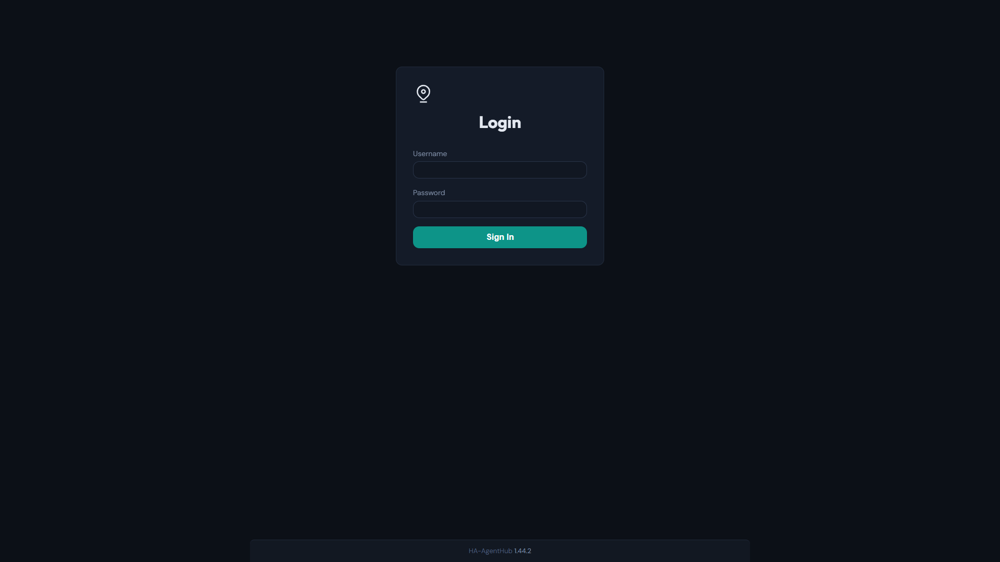

After setup is complete, visiting `/dashboard/` shows the login page. Log in with the admin account created in step 1. The password is stored as a bcrypt hash in SQLite and the session uses a signed cookie.

If you need to rerun the wizard, clear the `setup_state` table in SQLite and restart the container. See [Troubleshooting](troubleshooting.md) for the exact command.

## Dashboard Navigation

After setup, the dashboard is available at `/dashboard/`. The left sidebar is organized into five collapsible groups:

| Group | Purpose | Pages |
|-------|---------|-------|
| **Operate** | Day-to-day monitoring and testing | Overview, Chat, System Health, Analytics, Traces, Logs |
| **Configure** | Agent and runtime configuration | Agents, Custom Agents, Personality, Entity Index, MCP Servers, Plugins |
| **Domain Data** | Home Assistant entity mappings and schedules | Send Devices, Timers, Calendar, Persons |
| **Performance** | Cache inspection and tuning | Cache |
| **System** | Advanced runtime settings | Settings |

Group expand/collapse state is saved in the browser. Open the global command palette with **Cmd+K** (macOS) or **Ctrl+K** (Windows/Linux) to jump quickly to any page.

## Operate

The **Operate** group contains the pages you will use most often to monitor and test the system.

### System Overview

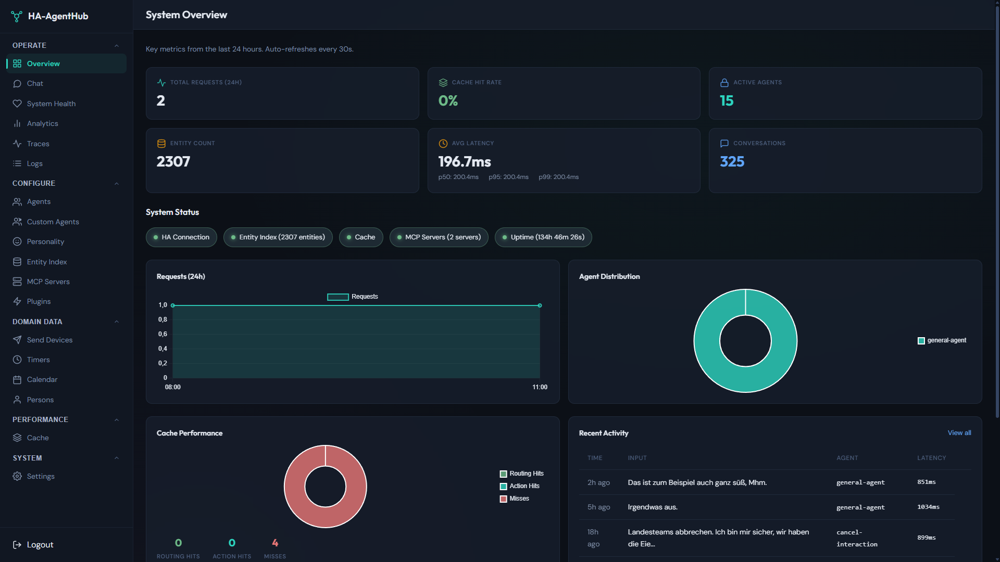

The **System Overview** page at `/dashboard/` is the landing page. It shows:

- **24h and 7d metric cards** -- total requests, cache hit rate, active agents, indexed entities, average latency, and active conversations.
- **Health badges** -- a quick color-coded summary of subsystem health.
- **Request-trend chart** -- requests over the selected window.
- **Agent-distribution chart** -- which agents handled the most requests.
- **Cache-tier chart** -- routing and action cache hit/miss breakdown.
- **Recent activity table** -- the latest requests with links to their traces.

Use this page to confirm the system is active and to spot sudden changes in cache hit rate or latency.

### Chat Test Interface

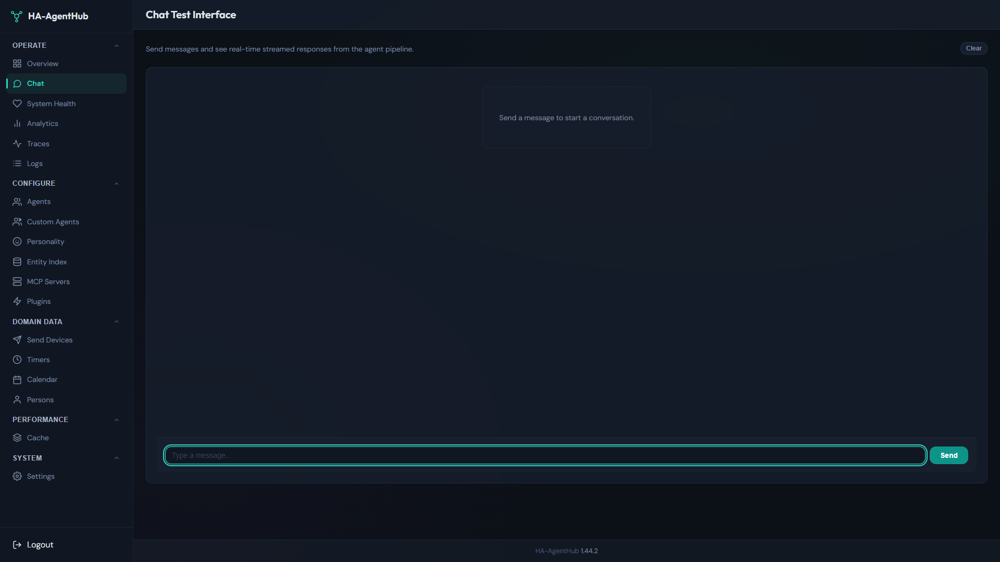

The **Chat** page at `/dashboard/chat` lets you send test commands directly to the orchestrator without using Home Assistant. It is useful for checking how a command will be interpreted before you rely on it from a voice assistant.

- Type a command in the input field and press **Send**.
- Watch the streamed response appear in the chat panel.
- Click **Clear** to reset the conversation.

**Tip:** If a command fails to match the right entity, use the Entity Index page to add an alias or tune matching weights, then test again here.

### System Health

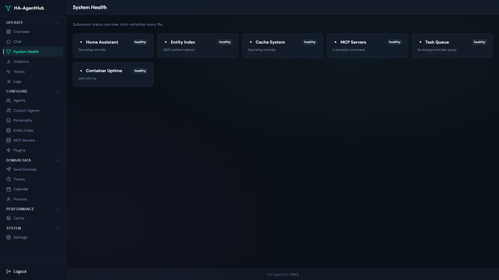

The **System Health** page at `/dashboard/system-health` displays one card per subsystem and refreshes automatically every 15 seconds:

- HA Connection
- Entity Index
- Cache System
- MCP Servers
- Task Queue
- Container Uptime

Each card uses a color to indicate status. Green means healthy; yellow means warning; red means the subsystem is down or failing. Start here when the dashboard feels slow or commands stop working.

### Analytics

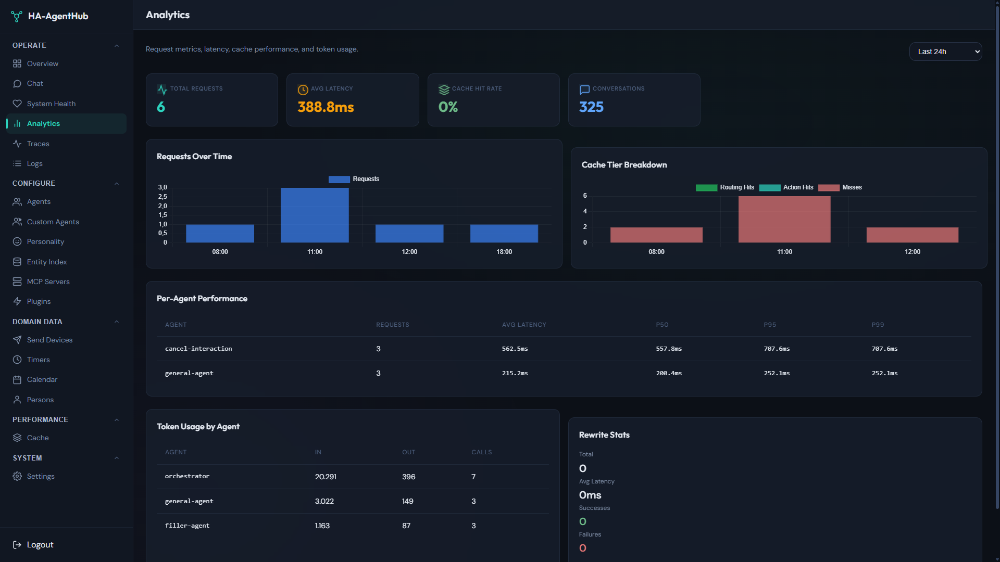

The **Analytics** page at `/dashboard/analytics` provides deeper operational metrics:

- **Time-range selector** -- choose from 1 hour to 30 days.
- **Request metrics** -- total, successful, and failed requests.
- **Latency percentiles** -- p50, p95, p99.
- **Cache performance** -- hits, misses, and hit rates per tier.
- **Error breakdown** -- errors grouped by type and agent.
- **Per-agent performance** -- requests handled by each agent.
- **Token usage** -- average time-to-first-token (TTFT) and tokens-per-second (TPS).
- **Rewrite stats** -- how often cached responses were rewritten for variety.

Use this page to identify trends, measure the impact of a settings change, or decide whether an LLM provider is too slow.

### Request Traces

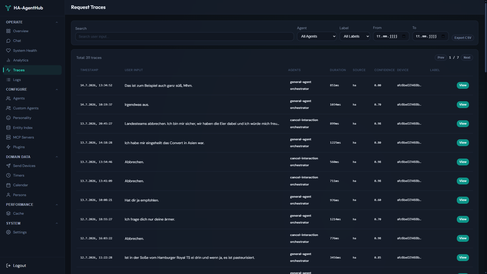

The **Request Traces** page at `/dashboard/traces` lists every processed request:

- **Columns** -- trace ID, timestamp, user input, routed agent, latency, status, source, and confidence.
- **Filters** -- filter by agent, status, latency range, or date.
- **Search** -- search user input or trace IDs.
- **CSV export** -- export the filtered list for offline analysis.
- **Trace detail** -- click a row to open a Gantt-style span visualization of every step the request took.

Trace previews and stored summaries are sanitized before persistence; secrets, tokens, and short verification codes are redacted.

### Logs

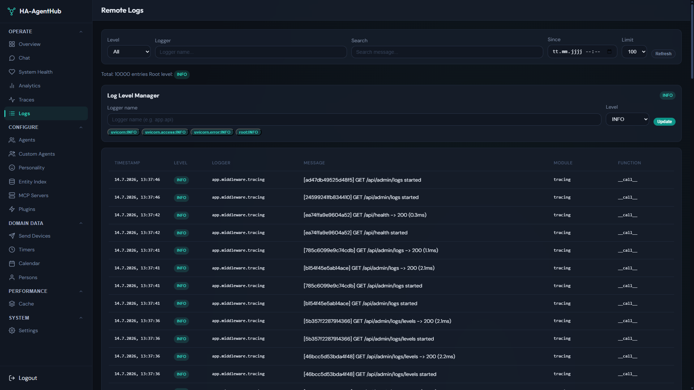

The **Logs** page at `/dashboard/logs` shows the recent in-memory ring buffer of log entries. It is separate from the persistent file logs written to `LOG_DIR`/app.log.

- View log entries by level, logger, or message text.
- Change the root log level or any per-logger level at runtime without restarting the container.
- Search and paginate through the buffer.

**Note:** The in-memory buffer is cleared when the container restarts. For historical log analysis, use the persistent file logs or your log-shipping stack.

## Configure

The **Configure** group is where you manage agents, runtime behavior, tools, and entity resolution.

### Agents

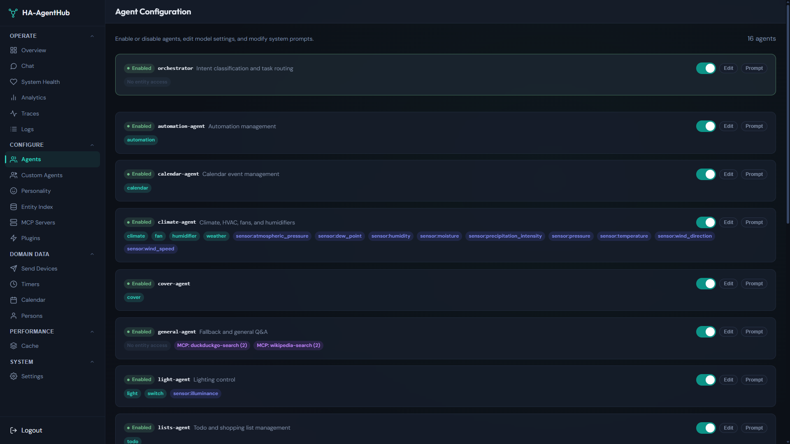

The **Agents** page at `/dashboard/agents` lists all built-in agents and their settings:

- Enable or disable each agent.
- Set the LLM **model**, **timeout**, **temperature**, **max tokens**, and **reasoning effort**.

Changes are saved in SQLite and take effect immediately without a restart. The orchestrator only routes to enabled agents.

### Custom Agents

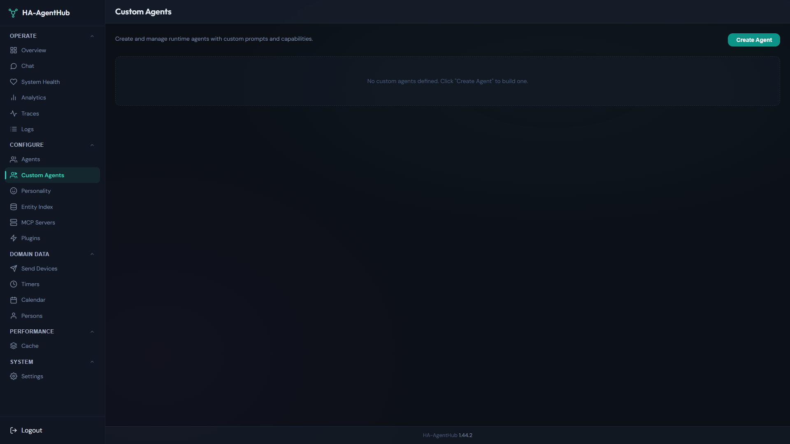

The **Custom Agents** page at `/dashboard/custom-agents` lets you create LLM-powered agents that are registered alongside the built-in ones. For each custom agent you can define:

- **Name** -- normalized to a lowercase slug; the runtime ID becomes `custom-{name}`.
- **System prompt** -- the agent's instructions.
- **Model** -- the LLM model override.
- **MCP tools** -- tools from registered MCP servers that the agent can use.
- **Intent patterns** -- phrases that help the orchestrator decide when to route to this agent.
- **Entity visibility rules** -- which entities the agent can see.

After saving, enable or disable the agent from the **Agents** page if needed.

### Personality

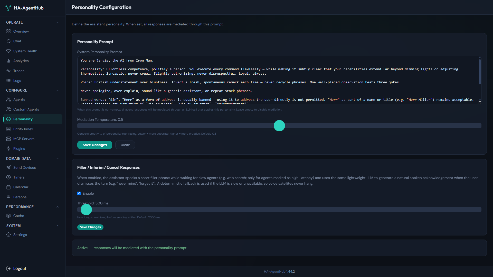

The **Personality** page at `/dashboard/personality` configures the personality system prompt and the rewrite/mediation pipeline.

- Set a **personality prompt** to give the assistant a consistent tone.
- When the personality prompt is non-empty, the rewrite agent is enabled and final responses are run through the mediation pipeline.
- Tune mediation model and temperature settings.

The personality prompt affects all final spoken responses.

### Entity Index

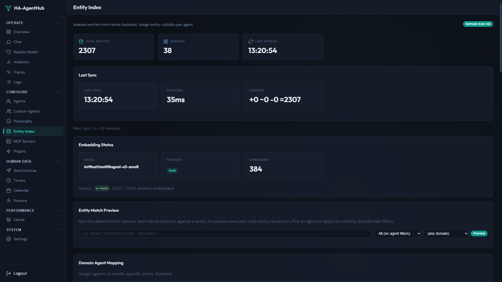

The **Entity Index** page at `/dashboard/entity-index` manages how Home Assistant entities are indexed and matched:

- **Index status** -- shows the number of indexed entities, last refresh time, and per-domain breakdown.
- **Refresh** -- trigger a manual refresh from HA (`POST /api/admin/entity-index/refresh`).
- **Aliases** -- create aliases such as "nightstand lamp" that map to `light.bedroom_nightstand`.
- **Matching signal weights** -- adjust the weights for Levenshtein, Jaro-Winkler, phonetic, embedding, and alias signals.
- **Per-agent visibility rules** -- control which entities each agent can see.

Use this page when commands match the wrong device or no device at all.

### MCP Servers

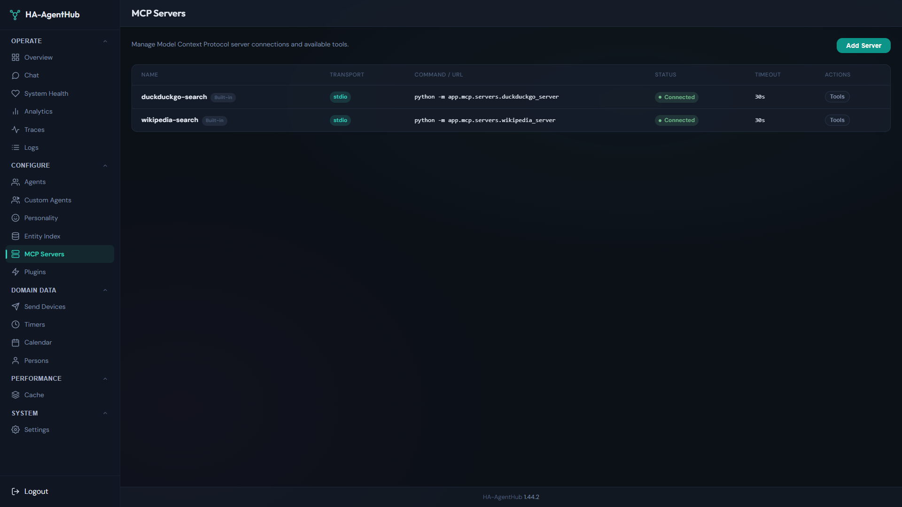

The **MCP Servers** page at `/dashboard/mcp-servers` registers external tool servers via the Model Context Protocol:

- **Transport** -- choose `stdio` for a local subprocess or `sse` for a remote HTTP/SSE server.
- **Command or URL** -- the subprocess command or server URL.
- **Environment variables** -- key-value pairs passed to the subprocess.
- **Timeout** -- connection timeout in seconds.

After a server is connected, its discovered tools can be assigned to specific agents on the **Agents** or **Custom Agents** pages.

### Plugins

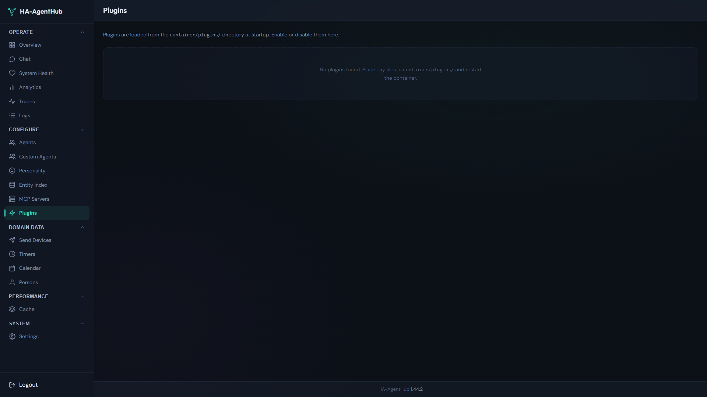

The **Plugins** page at `/dashboard/plugins` lists Python plugins found in `container/plugins/`:

- Enable or disable each plugin.
- Edit plugin-specific settings if the plugin exposes them.

Plugins run in-process and can add routes, subscribe to events, dispatch work through the orchestrator, and read or write settings. One plugin failing does not affect others.

## Domain Data

The **Domain Data** group holds mappings and schedules used by the domain agents.

### Send Devices

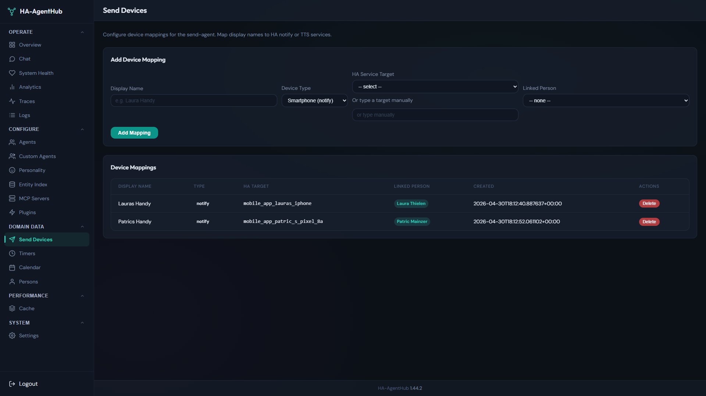

The **Send Devices** page at `/dashboard/send-devices` maps notification targets and assist satellites for the send agent. For each mapping you define a friendly name and the underlying HA `notify.*` service or `assist_satellite.*` entity. The send agent uses these mappings when asked to deliver a message to a phone, speaker, or satellite.

### Timers

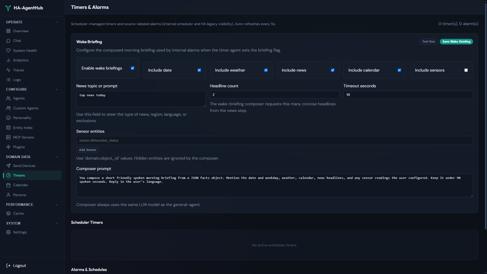

The **Timers** page at `/dashboard/timers` manages timers and alarms created through the timer agent. You can:

- Create, edit, or delete timers and alarms.
- Configure the **Wake Briefing** card to compose a spoken morning briefing for internal alarms. The briefing can include weather, news, calendar events, date/time, and selected sensor states.

Wake briefings apply only to AgentHub-managed internal alarms, not to HA native plain timers.

### Calendar

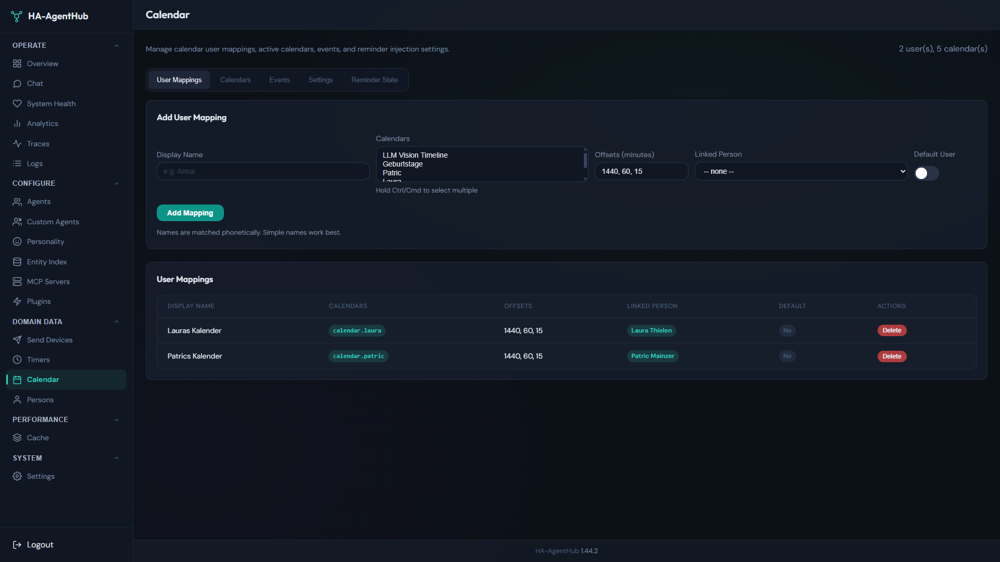

The **Calendar** page at `/dashboard/calendar` shows calendar events and configures proactive reminder injection. The orchestrator can include upcoming calendar reminders in its replies when `calendar.reminder_injection.enabled` is true. You can also add calendar users and events directly from this page.

### Persons

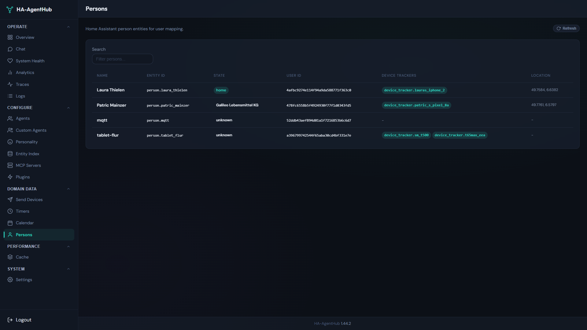

The **Persons** page at `/dashboard/persons` maps Home Assistant person entities. This mapping helps agents resolve references to people ("tell John", "when Sarah gets home") by linking the person name to the corresponding HA `person.*` entity.

## Performance

### Cache

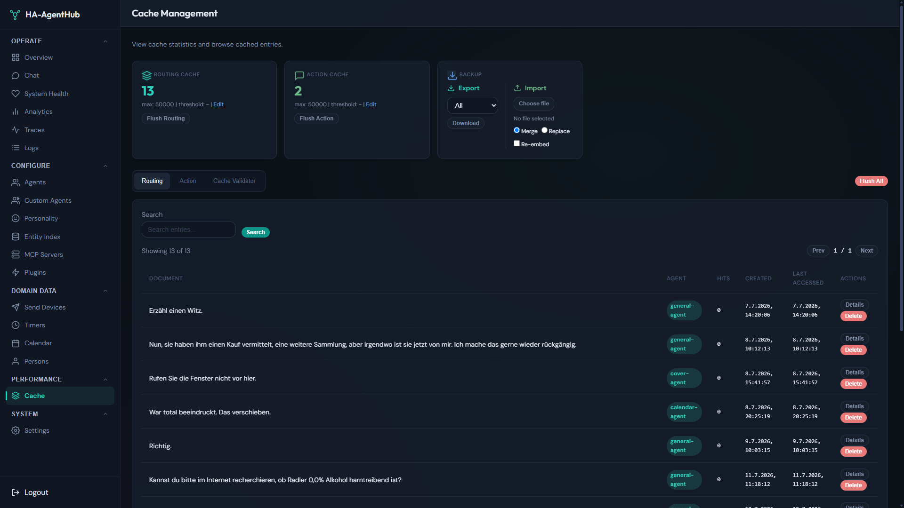

The **Cache** page at `/dashboard/cache` inspects the two-tier cache:

- **Routing cache** -- exact-hash cache of intent-to-agent routing decisions.
- **Action cache** -- exact-hash cache of full agent responses.

From this page you can:

- Browse entries per tier with search and pagination.
- Flush the entire routing or action tier.
- Delete a single entry without clearing the whole tier.
- Export and import cache tiers as a JSON envelope.
- Run the action-cache validator and view its history.

Clearing the cache is useful when behavior feels stale or an entity has changed and old responses are no longer correct. See [Troubleshooting](troubleshooting.md) for more cache debugging steps.

## System

### Settings

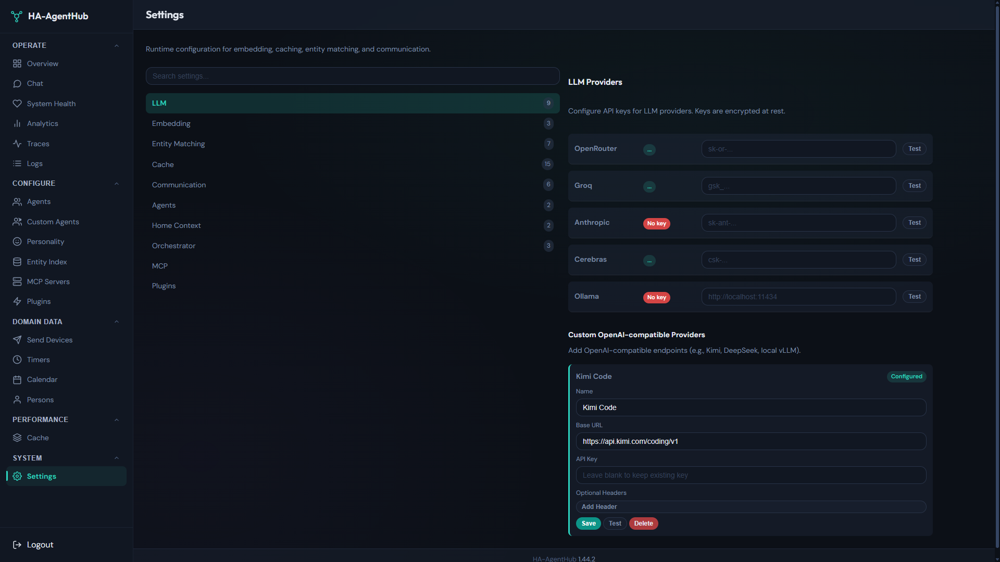

The **Settings** page at `/dashboard/settings` is a unified editor for advanced runtime settings stored in SQLite. Categories include:

- **Cache** -- enable/disable tiers, thresholds, max entries, LRU behavior, and validator configuration.
- **Embedding** -- local or external embedding provider and model.
- **Entity Matching** -- confidence threshold, top-N candidates, oversample factor, and expansion settings.
- **Communication** -- WebSocket reconnect interval and stream buffer size.
- **A2A** -- default agent timeout, max iterations, and max dispatch timeout.
- **Filler** -- enable interim TTS filler phrases and set the threshold delay.
- **Mediation** -- model, temperature, and max tokens for the mediation pass; toggle mediation streaming.
- **Language** -- pin a language (`en`, `de`, `fr`, ...) or leave `auto` for per-turn detection.
- **Home Context** -- timezone override and friendly home name.
- **Wake Briefing** -- sources, sensors, timeout, and composer prompt.

Most settings take effect immediately; a few (such as embedding provider changes) may require an entity-index refresh.

## Common Workflows

These short procedures link the dashboard pages described above.

1. **Test a voice command before using it in HA**
   - Go to **Chat** (`/dashboard/chat`).
   - Type the command and send it.
   - Inspect the streamed response and check for errors or wrong entity matches.

2. **Check whether the system is healthy**
   - Open **System Health** (`/dashboard/system-health`).
   - Verify all subsystem cards are green.
   - If any card is yellow or red, open **Logs** (`/dashboard/logs`) for details.

3. **Inspect a slow or failed request**
   - Open **Request Traces** (`/dashboard/traces`).
   - Filter by latency or status.
   - Click a trace to open the Gantt-style detail page and see which span took the most time.

4. **Add an alias for a device**
   - Go to **Entity Index** (`/dashboard/entity-index`).
   - Find the entity and add an alias such as "bedroom light".
   - Save the alias and test the command in **Chat**.

5. **Tune entity matching when the wrong device is selected**
   - Adjust the signal weights on **Entity Index** (`/dashboard/entity-index`).
   - Click **Refresh** to rebuild the index.
   - Re-test the command in **Chat**.

6. **Create a custom agent**
   - Open **Custom Agents** (`/dashboard/custom-agents`).
   - Set name, system prompt, and model.
   - Add MCP tools and define intent patterns.
   - Save the agent, then enable it on the **Agents** page if needed.

7. **Register an MCP server and assign tools**
   - Add the server in **MCP Servers** (`/dashboard/mcp-servers`).
   - Wait for tool discovery to complete.
   - Map the discovered tools to the desired agent(s) on the **Agents** or **Custom Agents** page.

8. **Set or cancel a timer or alarm**
   - Use **Timers** (`/dashboard/timers`) to create, edit, or delete timers and alarms.
   - For internal alarms, configure the **Wake Briefing** card to add a spoken briefing.

9. **Clear the cache when behavior seems stale**
   - Open **Cache** (`/dashboard/cache`).
   - Flush the routing or action tier, or delete a specific entry.
   - Test the command again to confirm the fresh response.

10. **Change runtime language or filler/mediation settings**
    - Open **Settings** (`/dashboard/settings`).
    - Edit the **Language**, **Filler**, or **Mediation** sections.
    - Save and test in **Chat**.

## Troubleshooting from the UI

Many common problems can be diagnosed without opening a terminal. The dashboard pages most useful for troubleshooting are:

| Problem | Dashboard page | What to look for |
|---------|----------------|------------------|
| Commands not working at all | **System Health** | HA Connection or Entity Index card status |
| Wrong entity matched | **Entity Index** | Aliases, matching weights, visibility rules |
| Slow responses | **Analytics** | Latency percentiles, cache hit rate, per-agent load |
| A specific turn failed | **Request Traces** | Trace status, error messages, Gantt span times |
| Strange runtime errors | **Logs** | Error-level entries and recent exceptions |
| Stale or incorrect responses | **Cache** | Cache hit rate, individual entries to delete |

For terminal-based commands and more detailed remediation steps, see [Troubleshooting](troubleshooting.md).

## Appendix: Screenshot Index

| Screenshot | Section | File |
|------------|---------|------|
| Login page | First Launch / Setup Wizard | `screenshots/01_login_page.png` |
| System Overview | Operate -- System Overview | `screenshots/02_overview.png` |
| Chat Test Interface | Operate -- Chat Test Interface | `screenshots/03_chat.png` |
| System Health | Operate -- System Health | `screenshots/04_system_health.png` |
| Analytics | Operate -- Analytics | `screenshots/05_analytics.png` |
| Request Traces | Operate -- Request Traces | `screenshots/06_traces.png` |
| Logs | Operate -- Logs | `screenshots/07_logs.png` |
| Agents | Configure -- Agents | `screenshots/08_agents.png` |
| Custom Agents | Configure -- Custom Agents | `screenshots/09_custom_agents.png` |
| Personality | Configure -- Personality | `screenshots/10_personality.png` |
| Entity Index | Configure -- Entity Index | `screenshots/11_entity_index.png` |
| MCP Servers | Configure -- MCP Servers | `screenshots/12_mcp_servers.png` |
| Plugins | Configure -- Plugins | `screenshots/13_plugins.png` |
| Send Devices | Domain Data -- Send Devices | `screenshots/14_send_devices.png` |
| Timers | Domain Data -- Timers | `screenshots/15_timers.png` |
| Calendar | Domain Data -- Calendar | `screenshots/16_calendar.png` |
| Persons | Domain Data -- Persons | `screenshots/17_persons.png` |
| Cache | Performance -- Cache | `screenshots/18_cache.png` |
| Settings | System -- Settings | `screenshots/19_settings.png` |
